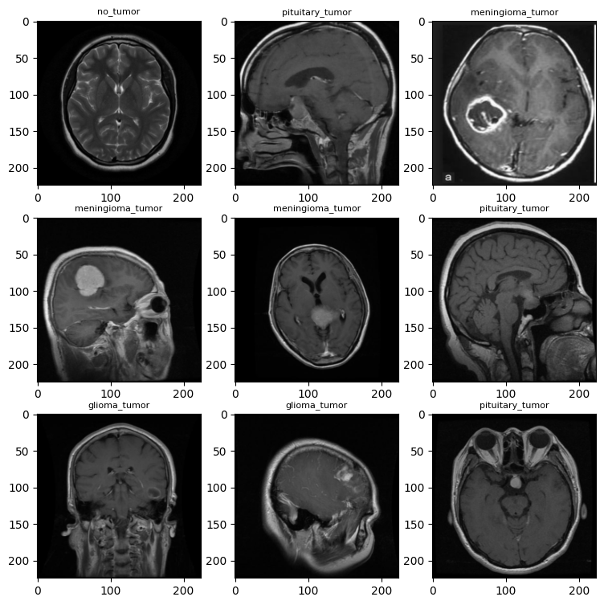

# Tumor-Classifier-PyTorch

## Project Tasks Status: 

### Data Preparation
- [:heavy_check_mark:] Create function to load data into the working directory
- [:heavy_check_mark:] Create a custom data class

### Model Development
- [:heavy_check_mark:] Build a baseline neural network class
- [:heavy_check_mark:] Build train and test model functions

### Project Management
- [:heavy_check_mark:] Create a function to train and test the model
- [:heavy_check_mark:] Containerize the project with Docker

### Ongoing Development
- [ ] Model Optimization
- [ ] Add Model Optimization functionality
- [ ] Add functionality to export generated models

### Documentation
- [ ] Finish README
    - [ ] Update Example Usage After model optimization functionality added
    - [ ] Create and Add Screenshots of Code Execution

## Table of Contents

1. [ Project Description](#project-description)
2. [ Libraries and Dependencies](#lib&dep)
3. [ Example Usage](#ex-use) 
4. [ Features](#features)
5. [ Acknowledgements](#ack)


<a name="project-description"></a>
## Project Description

The goal of this project is to use the PyTorch library to build a convolutional neural network to classify tumors given image data. Tumors are divided into four classes: no tumor, glioma tumor, meningioma_tumor, and pituitary tumor.

Data Source: [Brain Tumor Classification dataset](https://www.kaggle.com/datasets/prathamgrover/brain-tumor-classification)

Below is a sample of tumor images and their respective labels:



<a name="lib&dep"></a>
## Libraries and Dependencies

- **Libraries:**
  - PyTorch

- **Dependencies:**
  - torch
  - torchvision
  - torchmetrics
  - matplotlib
  - os
  - timeit
  - tqdm.auto
  - mlxtend
  - pathlib
  - PIL

<a name="ex-use"></a>
## Example Usage

Clarification: This is currently in a very raw format and the plan is to add functionality to make it 
more user friendly.

<pre>
```
    #define an image transform to adapt image data accordingly before modeling
    data_transform = transforms.Compose([
        transforms.Resize((224, 224)),
        transforms.TrivialAugmentWide(num_magnitude_bins=31),
        transforms.RandomHorizontalFlip(),
        transforms.ToTensor(),
    ])

    #create 
    train_dataset = Custom_Image_Dataset(image_directory=training_data_dir, transform=data_transform)
    test_dataset = Custom_Image_Dataset(image_directory=testing_data_dir, transform=data_transform)

    #create a train and test data loader to fetch batch data
    train_dataloader = DataLoader(train_dataset, batch_size=32, shuffle=True, num_workers=4)
    test_dataloader = DataLoader(test_dataset, batch_size=32, shuffle=True, num_workers=4)

    #set num iterations to train model
    NUM_EPOCHS = 50

    #create an instance of model
    model_0 = Custom_TinyVGG(input_shape=3, # number of color channels (3 for RGB) 
                    num_hidden_neurons=10, 
                    output_shape=4)
    model_0.to(device)

    #loss function
    loss_fn = nn.CrossEntropyLoss()

    #set up optimizer
    optimizer = torch.optim.Adam(params=model_0.parameters(), lr=0.001)

    #start timer
    from timeit import default_timer as timer 
    start_time = timer()

    #train model
    model_0_results = train_evaluate_model(model=model_0, 
                            train_dataloader=train_dataloader,
                            test_dataloader=test_dataloader,
                            optimizer=optimizer,
                            device=device,
                            epochs=NUM_EPOCHS,
                            loss_fn=loss_fn)

    #end timer, output total time
    end_time = timer()
    print(f"Total training time: {end_time-start_time:.3f} seconds")
```

</pre>


<a name="features"></a>
## Features

This section will be completed after model optimization and adjustments to model architecture are made. 


<a name="ack"></a>
## Acknowledgements
VGG Architecture: [CNN Explainer](https://poloclub.github.io/cnn-explainer/)
Background Knowledge: [https://www.learnpytorch.io/]


